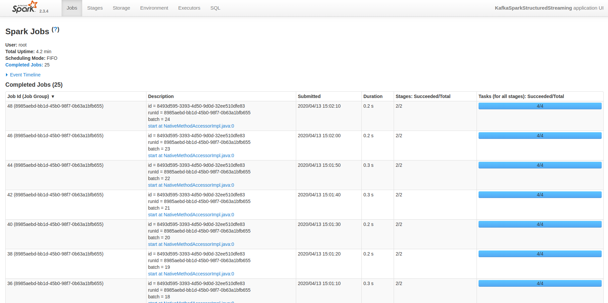

# sf-crime-statistics
This project provides statistical analyses on crime data in San Francisco using Apache Spark Structured Streaming. The real-world dataset was extracted from Kaggle 

## Development Environment

* Spark 2.4.3
* Scala 2.11.x
* Java 1.8.x
* Kafka build with Scala 2.11.x
* Python 3.6.x or 3.7.x

## QuickStart

Install requirements using `./start.sh` if you use conda for Python. If you use pip rather than conda, then use `pip install -r requirements.txt`.

### Run the Application
* Start Zookeeper and Kafka 
```
`bin/zookeeper-server-start.sh config/zookeeper.properties`
`bin/kafka-server-start.sh config/server.properties`
```

* Produce data into __sf.crimes__ topic

```
python kafka_server.py
```

* Submit Spark Streaming Job using the command:

```
spark-submit --packages org.apache.spark:spark-sql-kafka-0-10_2.11:2.3.4 --master local[*] data_stream.py
```


## Results
### Kafka Consumer Console Output

### Progress Reporter

### Spark UI


### Question 1

> How did changing values on the SparkSession property parameters affect the throughput and latency of the data?

After tuning the application using different parameters, I saw that the __processedRowsPerSecond__ increased 
and the time needed to process each micro batch decreased  


### Question 2
> What were the 2-3 most efficient SparkSession property key/value pairs? Through testing multiple variations on values, how can you tell these were the most optimal?

Based on testing various values for some parameters, I found that changing __maxRatePerPartition__ and __spark.sql.shuffle.partitions__
had an impact on throughput and speed.

the most efficient values were:
* __maxRatePerPartition__ = 200
* __spark.sql.shuffle.partitions__ = 2

Smaller values for __maxRatePerPartition__ yielded a lower value for __processedRowsPerSecond__, while larger values
than 200 didn't really increase the number of __processedRowsPerSecond__ significantly 

Changing the value __spark.sql.shuffle.partitions__ seemed to have a big impact on performance.
The default value which is 200 was not optimal as data was shuffled a lot. Since this operation is expensive,
the time needed to process every micro batch was very high (6 to 9 seconds) . Reducing this value improved the time needed to process
every micro batch. The optimal value for __spark.sql.shuffle.partitions__ was 2. This resulted in micro batch processing
 time of 200 to 300 milliseconds. This was the optimal value since the RDD has the same number of partitions as the kafka 
 topic which is equal to 2. Thus, no shuffles happened. 